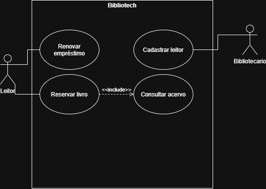

# Atividade 17 — Da esteira ao diagrama (BiblioTech)

- **Aluno(a):** Kauê Mendes
- **Turma:** 2º ano — Técnico em Informática Integrado
- **Disciplina:** Análise e Projeto de Sistemas — Profe. Berssa

## O que tem nesta pasta

| Arquivo | O que é |
|---|---|
| [esteira-da-analise.md](esteira-da-analise.md) | As esteiras, rastreabilidade, relacionamentos e autoavaliação |
| [diagrama-casos-de-uso.png](diagrama-casos-de-uso.png) | O diagrama (imagem) |
| [diagrama-casos-de-uso.drawio](diagrama-casos-de-uso.drawio) | O diagrama (arquivo editável) |

## Diagrama

## Conceito pretendido

**Conceito:** A

### Decisão de Modelagem Mais Difícil
A decisão mais difícil foi definir a relação de dependência entre `Reservar livro (RF02)` e `Consultar acervo (RF03)`. Optei por utilizar um relacionamento de `«include»` partindo de `Reservar livro` em direção a `Consultar acervo`, pois o sistema precisa, de forma obrigatória (SEMPRE), validar a existência e a disponibilidade do título antes de confirmar a reserva solicitada pelo leitor.

A justificativa detalhada e a autoavaliação por critérios estão ao final do arquivo [`esteira-da-analise.md`](esteira-da-analise.md).